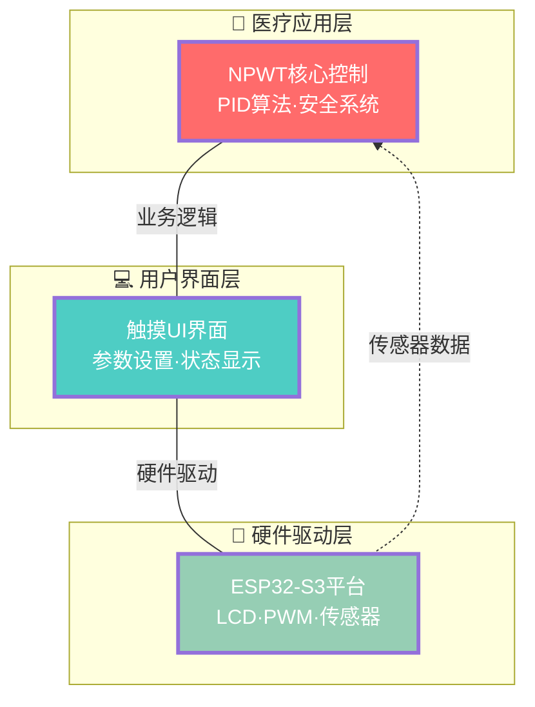
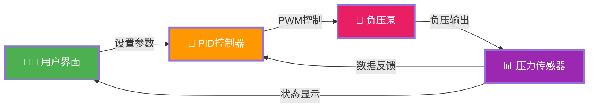
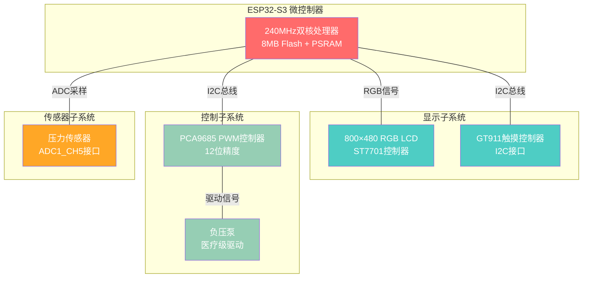
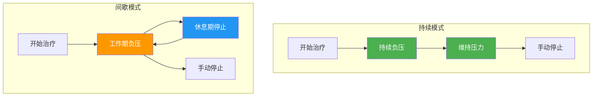
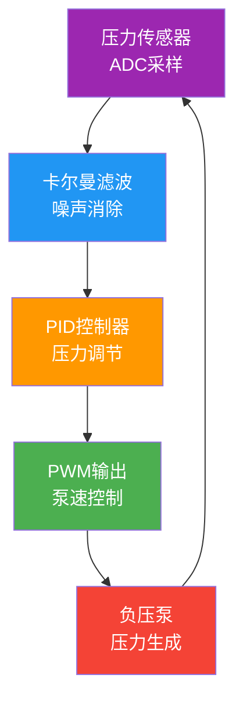
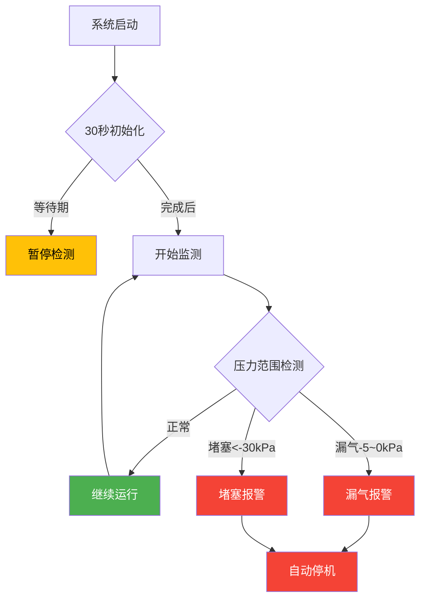
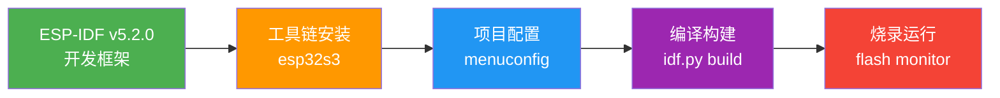

# THU-NPWT

> 基于ESP32-S3的专业医疗级负压创面疗法(NPWT)设备，配备800x480触摸屏和精密压力控制系统

[](https://github.com/espressif/esp-idf)
[](https://lvgl.io/)
[](LICENSE)

## 🏥 项目概述

本项目是一个完整的负压创面疗法(NPWT)医疗设备解决方案，采用ESP32-S3微控制器，集成了精密的压力控制、实时监测、用户界面和安全保护系统。设备能够提供-30kPa至-10kPa的精确负压控制，支持持续和间歇两种治疗模式。

### ✨ 核心特性

- 🎯 **精密压力控制**: PID闭环控制 + 卡尔曼滤波，控制精度±1kPa
- 📱 **触摸式界面**: 800x480高分辨率彩色触摸屏，中文用户界面
- 🔄 **双工作模式**: 持续模式和间歇模式，满足不同治疗需求
- 🛡️ **安全保护系统**: 漏气检测、堵塞检测、异常自动停止
- 📊 **实时监测**: 压力、泵速、工作状态的实时显示和记录
- 🔧 **专业级硬件**: PCA9685 PWM控制器，GT911触摸控制器

## 🏗️ 系统整体框架

### 系统架构设计



### 系统数据流向图



#### 💡 核心流程
1. **用户设置** → PID控制 → PWM驱动 → 负压治疗
2. **压力反馈** → 传感器检测 → 数据处理 → 界面显示

## 🔧 硬件配置

### 核心硬件规格

| 组件 | 型号/规格 | 用途 |
|------|-----------|------|
| **主控芯片** | ESP32-S3 (240MHz) | 系统控制核心 |
| **存储器** | 8MB Flash + PSRAM | 程序存储与运行内存 |
| **显示屏** | 800x480 RGB LCD | 用户界面显示 |
| **显示控制器** | ST7701 | LCD驱动控制 |
| **触摸控制器** | GT911 (I2C) | 触摸输入检测 |
| **PWM控制器** | PCA9685 (I2C) | 泵速精密控制 |
| **压力传感器** | ADC1_CH5 (GPIO6) | 负压监测 |

### 引脚定义

```c
// I2C总线配置
#define NPWT_I2C_SDA_GPIO           8       // I2C数据线
#define NPWT_I2C_SCL_GPIO           9       // I2C时钟线
#define NPWT_I2C_FREQ_HZ            100000  // I2C频率 100kHz

// 压力传感器
#define NPWT_ADC_CHANNEL            ADC_CHANNEL_5    // GPIO6

// PCA9685配置
#define NPWT_PCA9685_ADDR           0x40    // I2C地址
#define NPWT_PCA9685_PWM_CHANNEL    0       // 使用PWM通道0
```

### 硬件连接架构



## 📱 用户界面

### 界面设计概览


### 核心功能区域

| 界面区域 | 主要功能 | 显示内容 |
|:---:|:---:|:---:|
| **📊 监测显示** | 实时数据显示 | 当前压力·目标压力·泵速·状态 |
| **🎛️ 控制面板** | 操作控制 | 电源开关·设置入口·进度条 |
| **⚙️ 参数配置** | 治疗参数设置 | 压力·时间·模式·保存 |
| **🔔 状态提示** | 系统状态反馈 | 运行状态·异常报警·倒计时 |

## 🎮 工作模式

### 治疗模式对比



| 模式类型 | 工作特性 | 适用场景 |
|:---:|:---:|:---:|
| **持续模式** | 恒定负压·持续引流 | 渗液较多的新鲜创面 |
| **间歇模式** | 周期刺激·平衡血供 | 需要促进愈合的慢性创面 |

## 🔬 核心算法

### 算法架构图



### 关键算法参数

| 算法模块 | 核心参数 | 数值设定 | 功能作用 |
|:---:|:---:|:---:|:---:|
| **PID控制器** | Kp=20.0, Ki=2.0, Kd=1.0 | 快速响应参数 | 精密压力调节 |
| **卡尔曼滤波** | Q=0.01, R=0.1 | 噪声抑制参数 | 信号平滑处理 |
| **传感器校准** | 零点480mV, 系数-0.0495 | 线性转换参数 | 压力值换算 |

## 🛡️ 安全保护系统

### 安全检测流程



### 异常处理机制

| 异常类型 | 检测条件 | 响应动作 | 恢复方式 |
|:---:|:---:|:---:|:---:|
| **🚨 敷料漏气** | 压力-5~0kPa·目标<-10kPa·持续5秒 | 报警+自动停机 | 手动重启 |
| **🚧 管道堵塞** | 压力<-30kPa·持续5秒 | 报警+自动停机 | 手动重启 |
| **⏱️ 启动保护** | 开机后30秒内 | 暂停检测 | 自动恢复 |

## 📊 技术规格

### 核心技术指标

| 技术类别 | 关键指标 | 性能参数 |
|:---:|:---:|:---:|
| **🎯 压力控制** | 控制范围·精度·响应时间 | -30~-10kPa·±1kPa·1-2秒 |
| **⚡ 系统性能** | 采样率·刷新率·任务频率 | 10Hz·1Hz·10Hz |
| **💾 存储配置** | Flash·PSRAM·NVS | 8MB·8MB·16KB |
| **🔌 电气参数** | 电压·电流·分辨率 | 3.3V·150-300mA·12bit |

## 🚀 快速开始

### 开发环境设置



### 构建命令

```bash
# 环境设置
source ~/esp/esp-idf/export.sh

# 项目构建
idf.py set-target esp32s3
idf.py build
idf.py -p PORT flash monitor
```

2. **验证安装**
```bash
# 检查ESP-IDF版本
idf.py --version

# 检查工具链
xtensa-esp32s3-elf-gcc --version
```

3. **克隆项目代码**
```bash
git clone https://github.com/你的用户名/THU-NPWT.git
cd THU-NPWT
```

### 编译和烧录

1. **配置目标芯片**
```bash
idf.py set-target esp32s3
```

2. **项目配置 (可选)**
```bash
idf.py menuconfig
# 导航到 "Example Configuration" 进行配置
# 主要配置项：
# - Display Configuration
# - LVGL Configuration
# - Component Configuration
```

3. **编译项目**
```bash
idf.py build
```

4. **烧录到设备**
```bash
# 连接ESP32-S3开发板，确认端口
ls /dev/ttyUSB*  # Linux
ls /dev/tty.usbserial-*  # macOS

# 烧录固件
idf.py -p /dev/ttyUSB0 flash

# 烧录并监控串口
idf.py -p /dev/ttyUSB0 flash monitor
```

5. **监控运行状态**
```bash
# 仅监控串口输出
idf.py -p /dev/ttyUSB0 monitor

# 退出监控: Ctrl+]
```

### 首次运行检查

启动后观察串口输出，确认以下信息：

```
I (xxx) NPWT_CORE: Initializing NPWT system...
I (xxx) NPWT_CORE: Scanning I2C devices...
I (xxx) NPWT_CORE: Found device at address: 0x40 (PCA9685)
I (xxx) NPWT_CORE: Found device at address: 0x14 (GT911)
I (xxx) NPWT_CORE: Running PCA9685 output test...
I (xxx) NPWT_CORE: UI bridge initialized successfully
I (xxx) NPWT_CORE: System ready for operation
```

## 📁 项目结构

```
THU-NPWT/
├── 📁 main/                          # 主应用程序
│   ├── 📄 main.c                     # 程序入口点和初始化
│   ├── 📄 npwt_core.c/h             # 核心控制逻辑和算法
│   ├── 📄 npwt_ui_bridge.c/h        # UI与业务逻辑桥接层
│   ├── 📄 npwt_ui_events.c          # UI事件处理函数
│   ├── 📄 lvgl_port.c/h             # LVGL移植适配层
│   └── 📄 waveshare_rgb_lcd_port.c/h # Waveshare LCD驱动
├── 📁 components/                    # 外部组件库
│   ├── 📁 lvgl__lvgl/               # LVGL图形库源码
│   ├── 📁 squareline_ui/            # SquareLine Studio UI设计
│   │   ├── 📁 screens/              # UI界面文件
│   │   ├── 📁 images/               # UI图像资源
│   │   ├── 📁 fonts/                # UI字体资源
│   │   └── 📄 ui.c/h                # UI组件定义
│   └── 📁 espressif__esp_lcd_touch_gt911/ # GT911触摸驱动
├── 📁 build/                        # 编译输出目录
├── 📄 CMakeLists.txt                # 顶层CMake构建文件
├── 📄 partitions_custom.csv         # 自定义Flash分区表
├── 📄 sdkconfig.defaults            # 默认配置参数
├── 📄 dependencies.lock             # 组件依赖版本锁定
├── 📄 CLAUDE.md                     # 开发指南和规范
└── 📄 README.md                     # 项目说明文档
```

### 核心模块说明

#### 1. NPWT核心控制 (`npwt_core.c/h`)
```c
// 主要功能
- npwt_system_init()      // 系统初始化
- npwt_pid_calculate()    // PID控制算法
- npwt_mode_continuous_run()  // 持续模式控制
- npwt_mode_intermittent_run() // 间歇模式控制
- npwt_adc_read_pressure()    // 压力传感器读取
```

#### 2. UI桥接层 (`npwt_ui_bridge.c/h`)
```c
// 主要功能
- npwt_ui_update_main_screen()    // 主界面更新
- npwt_ui_check_anomalies()       // 异常检测逻辑
- npwt_ui_handle_power_button_clicked() // 电源按钮处理
- npwt_ui_handle_save_settings()  // 设置保存处理
```

#### 3. 硬件驱动层
```c
// LCD驱动 (waveshare_rgb_lcd_port.c)
- waveshare_esp32_s3_rgb_lcd_init() // LCD初始化
- waveshare_esp32_s3_touch_reset()  // 触摸复位

// LVGL移植 (lvgl_port.c)
- lvgl_port_init()        // LVGL端口初始化
- lvgl_port_lock()        // LVGL线程锁
```

## 🔧 开发指南

### 配置参数调节

#### 1. PID参数优化
根据系统响应特性调整PID参数：

```c
// 响应速度调节
if (response_too_slow) {
    pid->kp += 5.0f;   // 增大比例系数
    pid->ki += 0.5f;   // 增大积分系数
}

// 稳定性调节
if (system_oscillating) {
    pid->kp -= 5.0f;   // 减小比例系数
    pid->kd += 0.5f;   // 增大微分系数
}
```

#### 2. 滤波器参数调节
根据传感器噪声水平调整滤波参数：

```c
// 降噪效果调节
if (pressure_display_noisy) {
    kalman->R += 0.05f;  // 增大测量噪声权重
}

// 响应速度调节
if (filter_too_slow) {
    kalman->Q += 0.005f; // 增大过程噪声权重
}
```

#### 3. 异常检测阈值调节
根据实际使用情况调整检测阈值：

```c
// 漏气检测敏感度
#define LEAK_PRESSURE_MIN    -5    // 漏气压力下限
#define LEAK_PRESSURE_MAX     0    // 漏气压力上限
#define LEAK_DETECT_TIME   5000    // 检测时间(ms)

// 堵塞检测阈值
#define BLOCKAGE_PRESSURE  -30     // 堵塞检测压力(kPa)
#define BLOCKAGE_DETECT_TIME 5000  // 检测时间(ms)
```

### 调试功能详解

#### 1. 串口调试信息
系统提供详细的调试信息输出：

```c
// PID控制调试 (每2秒输出)
ESP_LOGI(TAG, "PID: setpoint=%.1f, input=%.1f, error=%.1f, out=%.1f",
         setpoint, input, error, pid_output);
ESP_LOGI(TAG, "Terms: P=%.1f, I=%.1f, D=%.1f", P_term, I_term, D_term);

// 压力传感器调试 (每1秒输出)
ESP_LOGI(TAG, "Pressure: raw=%.2f, filtered=%.2f, final=%d kPa",
         raw_pressure, filtered_pressure, final_pressure);

// 系统状态调试 (每2秒输出)
ESP_LOGI(TAG, "Status: power=%s, mode=%s, state=%s",
         power_on?"ON":"OFF", mode_str, state_str);
```

#### 2. I2C设备扫描
系统启动时自动扫描I2C总线：

```bash
I (xxx) NPWT_CORE: Scanning I2C devices...
I (xxx) NPWT_CORE: Found device at address: 0x40 (PCA9685)
I (xxx) NPWT_CORE: Found device at address: 0x14 (GT911)
I (xxx) NPWT_CORE: I2C scan completed, found 2 devices
```

#### 3. 性能监测
启用LVGL性能监测：

```c
// 在menuconfig中启用
CONFIG_LV_USE_PERF_MONITOR=y

// 显示FPS和CPU使用率
lv_obj_t *perf_monitor = lv_perf_monitor_create(lv_scr_act());
```

### 常见问题解决

#### 1. 编译问题
```bash
# 清理构建缓存
idf.py fullclean

# 重新获取组件依赖
rm -rf managed_components
idf.py reconfigure

# 更新组件
idf.py update-dependencies
```

#### 2. 烧录问题
```bash
# 检查串口权限
sudo usermod -a -G dialout $USER  # 需要重新登录

# 手动进入下载模式
# 按住BOOT按钮，按一下RESET按钮，释放BOOT按钮

# 使用擦除选项
idf.py -p /dev/ttyUSB0 erase_flash
idf.py -p /dev/ttyUSB0 flash
```

#### 3. 显示问题
```bash
# 检查LVGL配置
idf.py menuconfig
# Component config → LVGL configuration

# 检查LCD连接
# 确认所有数据线和控制线连接正确

# 检查电源电压
# 确认3.3V供电稳定，电流充足
```


## 🤝 贡献指南

### 代码规范

#### 1. 命名约定
```c
// 函数命名: 模块_功能_动作
npwt_pid_calculate()          // NPWT PID计算
npwt_ui_update_pressure()     // NPWT UI更新压力

// 变量命名: 小写下划线
int16_t current_pressure;     // 当前压力
uint32_t system_start_time;   // 系统启动时间

// 常量命名: 大写下划线
#define NPWT_PRESSURE_MIN     -30    // 最小压力值
#define NPWT_PWM_FREQUENCY    1000   // PWM频率

// 类型命名: 模块_类型_t
typedef struct npwt_settings_t;      // 设置结构体
typedef enum npwt_mode_t;            // 模式枚举
```

#### 2. 注释规范
```c
/**
 * @brief PID控制器计算函数
 * @param pid PID控制器结构体指针
 * @param setpoint 目标设定值 (kPa)
 * @param input 当前输入值 (kPa)
 * @return PID输出值 (0-1638范围)
 *
 * @note 该函数实现增量式PID算法，包含积分限幅和微分项计算
 * @warning 调用前确保PID结构体已正确初始化
 */
float npwt_pid_calculate(npwt_pid_t *pid, float setpoint, float input);
```

#### 3. 代码格式
```c
// 使用4空格缩进，不使用Tab
if (condition) {
    function_call();
    another_call();
}

// 大括号换行风格
if (condition)
{
    function_call();
}

// 运算符前后加空格
int result = a + b * c;
if (x == y && z > 0) {
    // code
}
```

### 开发流程

#### 1. 分支管理策略
```bash
# 主分支
main              # 稳定发布版本
develop           # 开发集成分支

# 功能分支
feature/ui-improve        # UI界面改进
feature/pid-optimization  # PID算法优化
feature/data-logging      # 数据记录功能

# 修复分支
hotfix/pressure-bug       # 压力控制bug修复
bugfix/display-issue      # 显示问题修复
```

#### 2. 开发步骤
```bash
# 1. 创建功能分支
git checkout develop
git pull origin develop
git checkout -b feature/new-function

# 2. 开发和测试
# ... 编码开发 ...
# ... 单元测试 ...
# ... 集成测试 ...

# 3. 提交代码
git add .
git commit -m "实现新功能: 详细功能描述

- 添加XXX功能模块
- 优化YYY算法性能
- 修复ZZZ已知问题
- 更新相关文档

测试: 所有单元测试通过，功能验证完成"

# 4. 推送和合并请求
git push origin feature/new-function
# 在GitHub/GitLab创建Pull Request

# 5. 代码审查和合并
# 经过代码审查后合并到develop分支
```

#### 3. 提交信息规范
```bash
# 提交信息格式
<类型>(<范围>): <简短描述>

<详细描述>

<测试说明>

# 类型说明
feat:     新功能
fix:      bug修复
docs:     文档更新
style:    代码格式调整
refactor: 代码重构
test:     测试相关
chore:    构建工具等

# 示例
feat(core): 实现自适应PID控制算法

添加了根据系统响应特性自动调节PID参数的功能：
- 实时监测控制效果
- 动态调整Kp, Ki, Kd参数
- 提升控制精度和稳定性

测试: 通过24小时稳定性测试，控制精度提升30%
```

### 问题报告模板

遇到问题时，请按以下模板提供信息：

```markdown
## 问题描述
简洁明确地描述遇到的问题

## 环境信息
- ESP-IDF版本: v5.2.0
- 硬件型号: ESP32-S3-DevKitC-1
- 操作系统: Ubuntu 20.04 LTS
- 编译工具链版本: gcc 8.4.0

## 复现步骤
1. 执行命令 `idf.py build`
2. 连接设备到端口 `/dev/ttyUSB0`
3. 运行 `idf.py flash monitor`
4. 观察到错误信息

## 预期行为
描述你期望看到的正确行为

## 实际行为
描述实际发生的错误行为

## 错误日志
```
粘贴完整的错误日志信息
```

## 尝试的解决方案
- 已尝试重新编译: 无效
- 已尝试更换端口: 无效
- 已检查硬件连接: 正常

## 附加信息
其他可能有用的信息或截图
```

## 📜 许可证

本项目采用 MIT 许可证 - 详见 [LICENSE](LICENSE) 文件

```
MIT License

Copyright (c) 2024 THU-NPWT Project

Permission is hereby granted, free of charge, to any person obtaining a copy
of this software and associated documentation files (the "Software"), to deal
in the Software without restriction, including without limitation the rights
to use, copy, modify, merge, publish, distribute, sublicense, and/or sell
copies of the Software, and to permit persons to whom the Software is
furnished to do so, subject to the following conditions:

The above copyright notice and this permission notice shall be included in all
copies or substantial portions of the Software.
```

## 📞 技术支持

### 文档资源
- 📖 **项目文档**: 查看 [`CLAUDE.md`](CLAUDE.md) 获取详细开发指南
- 💡 **示例代码**: 参考 `main/` 目录下的实现代码
- 🔧 **硬件说明**: 查看硬件连接和配置信息
- ❓ **常见问题**: 查看问题解答和故障排除

### 技术交流
- 📧 **问题反馈**: 通过GitHub Issues提交技术问题
- 💬 **讨论交流**: 参与GitHub Discussions技术讨论
- 📝 **功能建议**: 提交Enhancement请求和改进建议
- 🐛 **Bug报告**: 使用Issue模板报告软件缺陷

### 学习资源
- 📚 [ESP-IDF编程指南](https://docs.espressif.com/projects/esp-idf/zh_CN/latest/)
- 🎨 [LVGL图形库文档](https://docs.lvgl.io/)
- 🏥 [NPWT医疗设备标准](https://www.iso.org/standard/medical-devices.html)
- 🔬 [PID控制理论基础](https://en.wikipedia.org/wiki/PID_controller)

## 🙏 致谢

本项目的实现得益于以下优秀的开源项目和技术社区：

### 核心依赖
- **[ESP-IDF](https://github.com/espressif/esp-idf)** - Espressif官方物联网开发框架
- **[LVGL](https://lvgl.io/)** - 轻量级嵌入式图形库
- **[SquareLine Studio](https://squareline.io/)** - 专业UI设计工具

### 硬件支持
- **[Waveshare](https://www.waveshare.com/)** - 高质量LCD显示模块
- **[Espressif](https://www.espressif.com/)** - ESP32-S3芯片和开发工具

### 开源社区
- **ESP32开发者社区** - 提供丰富的技术资源和支持
- **LVGL社区贡献者** - 持续改进图形库功能和性能
- **医疗设备开源项目** - 分享宝贵的设计经验和标准

### 特别感谢
感谢所有为嵌入式开发和开源医疗设备做出贡献的开发者们！

---

<div align="center">

**🏥 专业医疗设备 · 🔬 精密控制系统 · 💻 现代化界面**

*基于ESP32-S3的下一代NPWT治疗设备*


**[⭐ 给项目加星标](https://github.com/username/THU-NPWT) | [🐛 报告问题](https://github.com/username/THU-NPWT/issues) | [💡 功能建议](https://github.com/username/THU-NPWT/discussions)**

</div>
