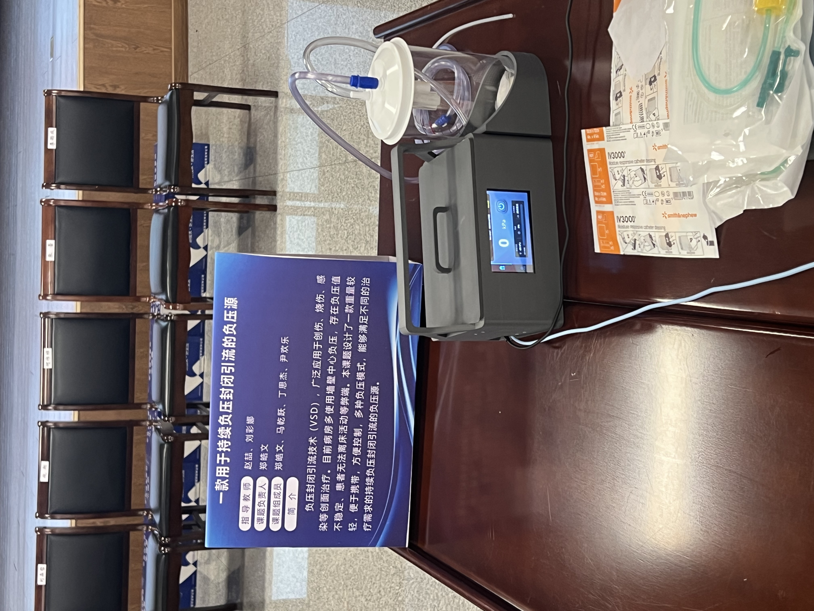
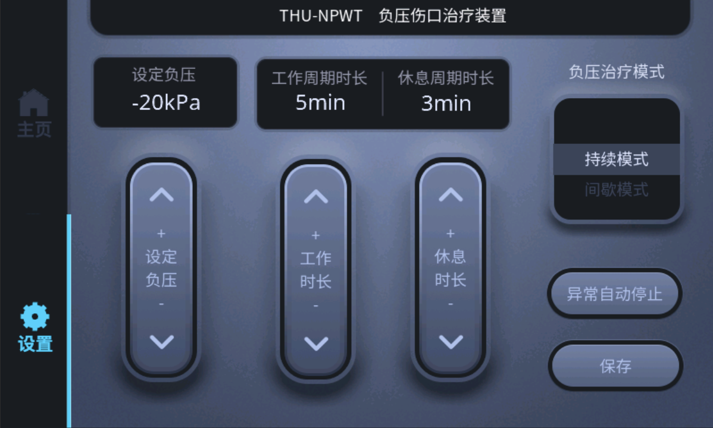
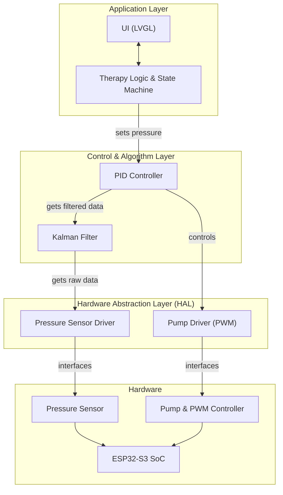
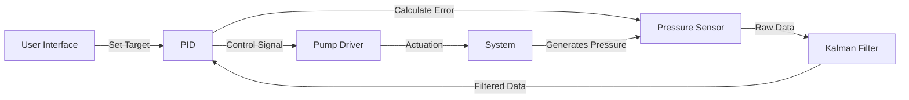
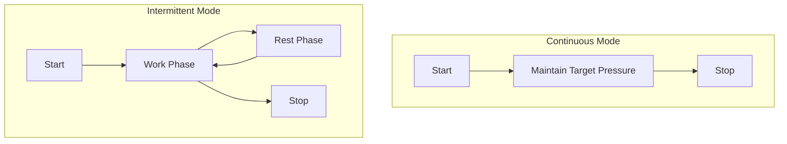

# PressureCare: An Embedded NPWT Controller

PressureCare is a professional-grade Negative Pressure Wound Therapy (NPWT) controller based on the ESP32-S3. It features a high-resolution touchscreen interface, precise pressure regulation through a PID control loop, and robust safety mechanisms. This project serves as a reference design for embedded medical device development.

[](https://github.com/espressif/esp-idf)
[](https://lvgl.io/)
[](LICENSE)

## Project Overview

Negative Pressure Wound Therapy is a therapeutic technique used to promote healing in acute and chronic wounds. This project implements the core functionalities of an NPWT device, including:

- **Precise Pressure Control**: Maintains a target sub-atmospheric pressure with a ±1 kPa accuracy.
- **Dual Therapy Modes**: Supports both continuous and intermittent therapy modes.
- **Real-time Monitoring**: Displays critical parameters such as current pressure, target pressure, and therapy duration.
- **User-friendly Interface**: A 800x480 touchscreen UI for setting and monitoring therapy parameters.
- **Safety Alarms**: Includes placeholder logic for leak and blockage detection.

## Demonstration

<table>
  <tr>
    <td valign="top">
      <p><strong>Video Demo</strong></p>
      <p>A complete demonstration of the system in operation, from startup to real-time pressure control.</p>
      https://github.com/user-attachments/assets/2721eb9b-3225-47eb-ae20-bf3e925fd7e3
    </td>
    <td valign="top">
      <p><strong>Hardware Prototype</strong></p>
      <p>The physical prototype of the PressureCare device.</p>
      
    </td>
  </tr>
</table>

### User Interface

<p align="center">
  
  
</p>

## Technical Architecture

The system is designed with a layered architecture to ensure modularity and maintainability.



- **Application Layer**: Manages the user interface (built with LVGL and SquareLine Studio) and the main therapy state machine.
- **Control & Algorithm Layer**: Implements the core control algorithms (PID) and signal processing (Kalman filter). These are designed as independent modules.
- **Hardware Abstraction Layer (HAL)**: Provides a standardized interface to the hardware, decoupling the application logic from specific hardware implementations (e.g., `hal_pressure_sensor.c`, `hal_pump.c`).
- **Hardware**: The physical components of the system.

## Core Features

### Pressure Control System

The core of the device is a closed-loop control system that precisely regulates pressure.



1.  **Sensing**: The pressure sensor continuously measures the pressure at the wound site.
2.  **Filtering**: A Kalman filter is applied to the raw sensor readings to reduce noise and provide a stable pressure value.
3.  **Control**: A PID (Proportional-Integral-Derivative) controller calculates the required pump speed by comparing the filtered pressure against the target pressure.
4.  **Actuation**: The pump speed is adjusted via a PWM signal to maintain the desired pressure.

### Therapy Modes

The controller supports two standard therapy modes.


- **Continuous Mode**: A constant negative pressure is applied for the duration of the therapy. This is typically used for wounds with high levels of exudate.
- **Intermittent Mode**: The system cycles between a set negative pressure (work time) and atmospheric pressure (rest time). This can help stimulate blood flow and granulation tissue formation.

## Hardware Specifications

### System Components

| Component           | Model/Type             | Interface | Purpose                               |
| ------------------- | ---------------------- | --------- | ------------------------------------- |
| **MCU**             | ESP32-S3               | -         | Main application and control processor|
| **Display**         | Waveshare 4.3"         | RGB       | 800x480 TFT LCD for UI                |
| **Touch Controller**| GT911                  | I2C       | Capacitive touch input                |
| **Pump Driver**     | PCA9685                | I2C       | External 12-bit PWM controller        |
| **Pressure Sensor** | Analog                 | ADC       | Measures sub-atmospheric pressure     |

### Key Parameters & Pinout

The following parameters are centralized in `main/app_config.h` for easy configuration.

| Module          | Parameter                 | Value                  |
| --------------- | ------------------------- | ---------------------- |
| **PID**         | Kp, Ki, Kd                | `20.0`, `2.0`, `1.0`   |
| **Kalman Filter** | Q (Process Noise)         | `0.01`                 |
| **Kalman Filter** | R (Measurement Noise)     | `0.1`                  |
| **I2C Bus**     | SDA, SCL                  | `GPIO 8`, `GPIO 9`     |
| **ADC**         | Channel                   | `ADC1_CHANNEL_5`       |

## Building and Running the Project

This project is built using the ESP-IDF (Espressif IoT Development Framework).

### Prerequisites

- ESP-IDF `v5.0` or later.
- A compatible ESP32-S3 development board (e.g., ESP32-S3-DevKitC-1).
- The hardware components listed above.

### Build Steps

1.  **Clone the repository:**
    ```bash
    git clone [repository-url]
    cd PressureCare
    ```

2.  **Set up ESP-IDF environment:**
    Follow the official ESP-IDF installation guide.

3.  **Connect the device** and ensure it is detected by your system.

4.  **Configure the project:**
    ```bash
    idf.py menuconfig
    ```
    *(No specific configuration is required for the base project, but you can customize settings here.)*

5.  **Build and flash:**
    ```bash
    idf.py build flash monitor
    ```

This will compile the project, flash it to the ESP32-S3, and open a serial monitor to view logs.

## License

This project is licensed under the MIT License. See the `LICENSE` file for details.
