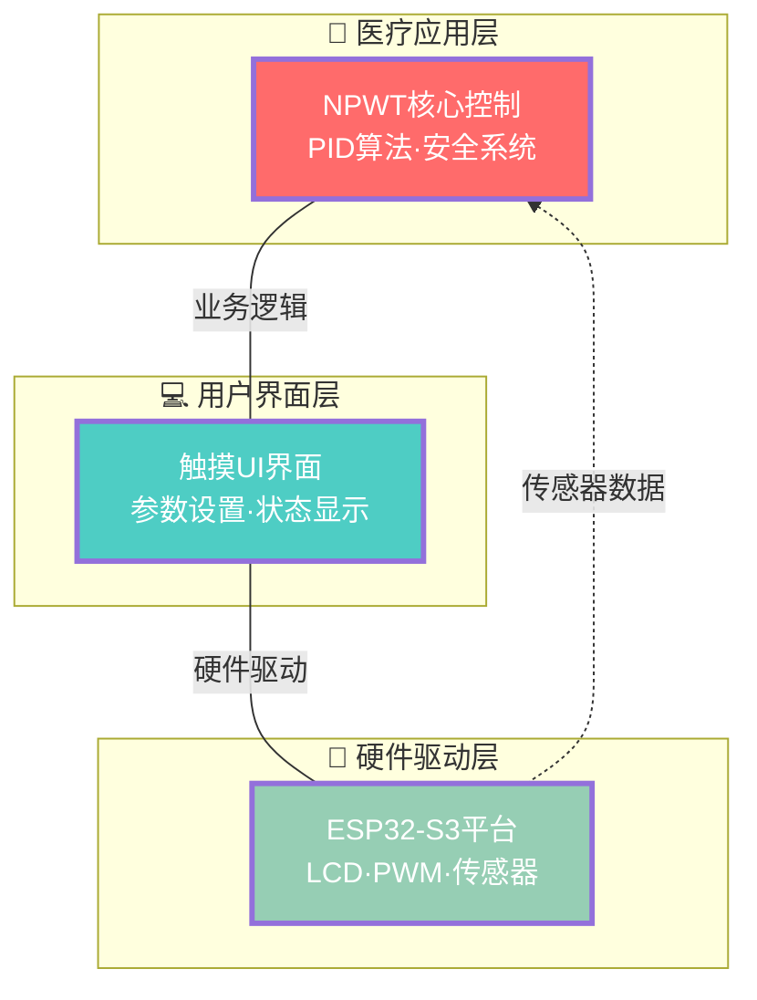
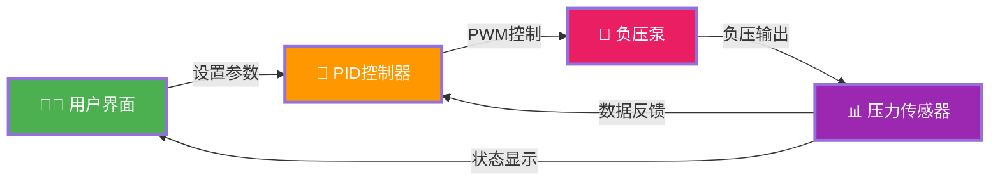
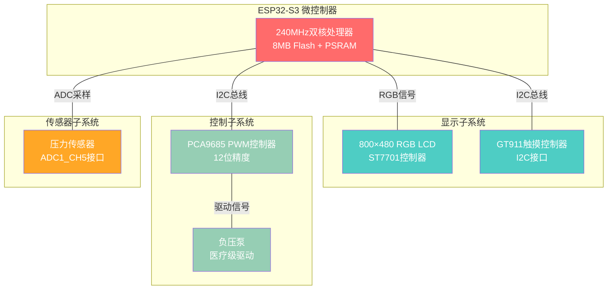
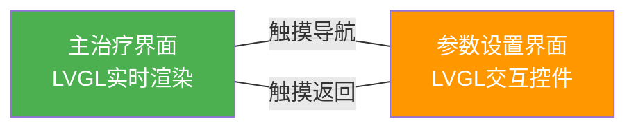
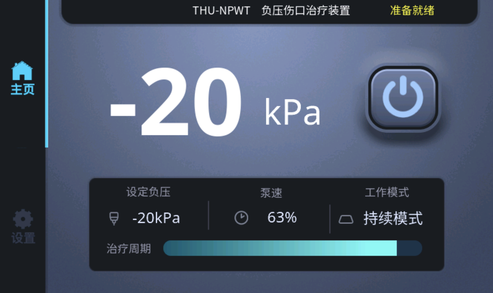
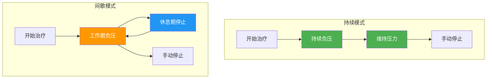
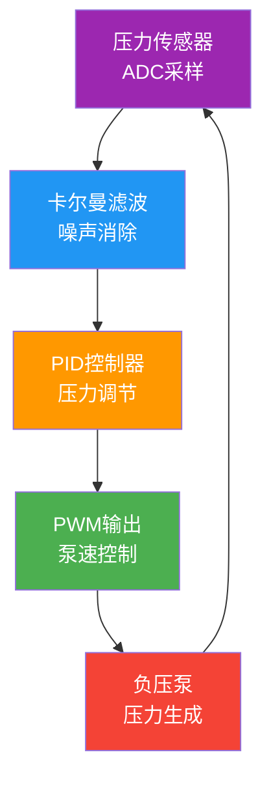
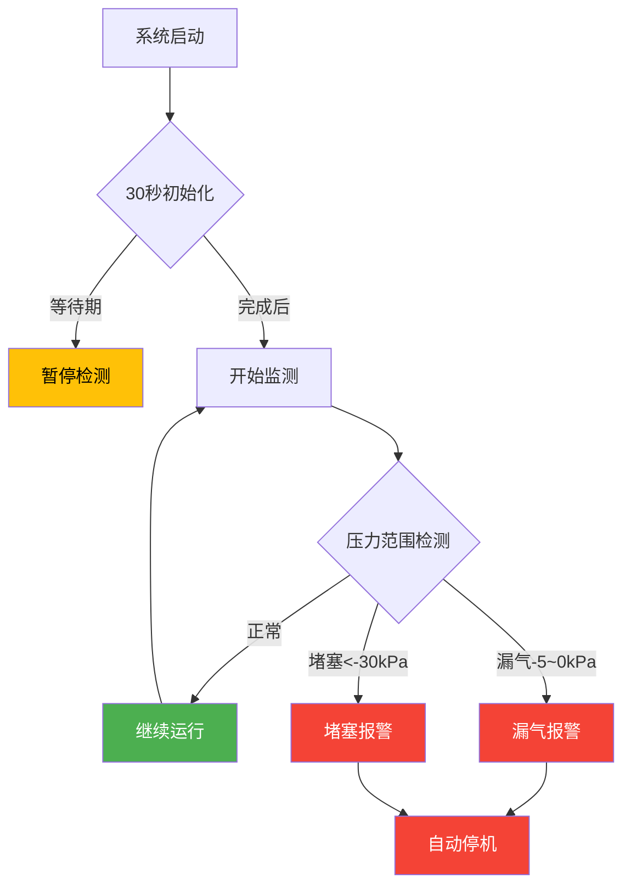

# THU-NPWT

> 基于ESP32-S3的专业医疗级负压创面疗法(NPWT)设备，配备800x480触摸屏和精密压力控制系统

[](https://github.com/espressif/esp-idf)
[](https://lvgl.io/)
[](LICENSE)

## 🏥 项目概述

本项目是一个完整的负压创面疗法(NPWT)医疗设备解决方案，采用ESP32-S3微控制器，集成了精密的压力控制、实时监测、用户界面和安全保护系统。设备能够提供-30kPa至-10kPa的精确负压控制，支持持续和间歇两种治疗模式。

### ✨ 核心特性

- 🎯 **精密压力控制**: PID闭环控制 + 卡尔曼滤波，控制精度±1kPa
- 📱 **触摸式界面**: 800x480高分辨率彩色触摸屏，中文用户界面
- 🔄 **双工作模式**: 持续模式和间歇模式，满足不同治疗需求
- 🛡️ **安全保护系统**: 漏气检测、堵塞检测、异常自动停止
- 📊 **实时监测**: 压力、泵速、工作状态的实时显示和记录
- 🔧 **专业级硬件**: PCA9685 PWM控制器，GT911触摸控制器

## 🏗️ 系统整体框架

### 系统架构设计



### 系统数据流向图



#### 💡 核心流程
1. **用户设置** → PID控制 → PWM驱动 → 负压治疗
2. **压力反馈** → 传感器检测 → 数据处理 → 界面显示

## 🔧 硬件配置

### 核心硬件规格

| 组件 | 型号/规格 | 用途 |
|------|-----------|------|
| **主控芯片** | ESP32-S3 (240MHz) | 系统控制核心 |
| **存储器** | 8MB Flash + PSRAM | 程序存储与运行内存 |
| **显示屏** | 800x480 RGB LCD | 用户界面显示 |
| **显示控制器** | ST7701 | LCD驱动控制 |
| **触摸控制器** | GT911 (I2C) | 触摸输入检测 |
| **PWM控制器** | PCA9685 (I2C) | 泵速精密控制 |
| **压力传感器** | ADC1_CH5 (GPIO6) | 负压监测 |

### 引脚定义

```c
// I2C总线配置
#define NPWT_I2C_SDA_GPIO           8       // I2C数据线
#define NPWT_I2C_SCL_GPIO           9       // I2C时钟线
#define NPWT_I2C_FREQ_HZ            100000  // I2C频率 100kHz

// 压力传感器
#define NPWT_ADC_CHANNEL            ADC_CHANNEL_5    // GPIO6

// PCA9685配置
#define NPWT_PCA9685_ADDR           0x40    // I2C地址
#define NPWT_PCA9685_PWM_CHANNEL    0       // 使用PWM通道0
```

### 硬件连接架构



## 📱 用户界面

> **界面技术**：采用 **LVGL 8.3** 图形库设计，结合 **SquareLine Studio** 专业UI工具，打造现代化医疗设备交互界面

### 界面设计概览



### 主治疗界面

<div align="center">

</div>

**LVGL界面组件**：
- **📊 lv_label 大字显示**：实时压力数值渲染（-20kPa）
- **⚡ lv_btn 电源按钮**：带状态切换的触摸按钮
- **📈 lv_panel 信息面板**：多列布局显示系统参数
- **🔄 lv_bar 进度条组件**：动态显示治疗周期进度
- **🏠 lv_btn 导航按钮**：界面切换控制

### 参数设置界面

<div align="center">

</div>

**LVGL交互组件**：
- **🎯 lv_spinbox 参数调节器**：三组独立的数值调节控件（负压-20kPa、工作5min、休息3min）
- **⬆️⬇️ lv_btn 调节按钮**：上下箭头按钮实现参数递增递减
- **🔄 lv_dropdown 模式选择器**：持续模式/间歇模式下拉选择
- **🛡️ lv_switch 开关组件**：异常自动停止功能切换
- **💾 lv_btn 保存按钮**：参数持久化存储操作
- **📊 lv_label 状态显示**：实时显示当前设定值

### LVGL技术特性

| 技术特性 | 实现方案 | 性能优势 |
|:---:|:---:|:---:|
| **🎨 渲染引擎** | 硬件加速+双缓冲 | 60FPS流畅显示 |
| **👆 触摸响应** | GT911驱动集成 | <50ms触摸延迟 |
| **🎭 主题风格** | 现代化深色主题 | 医疗级视觉体验 |
| **🔤 中文支持** | 自定义字体渲染 | 完整中文界面 |

## 🎮 工作模式

### 治疗模式对比



| 模式类型 | 工作特性 | 适用场景 |
|:---:|:---:|:---:|
| **持续模式** | 恒定负压·持续引流 | 渗液较多的新鲜创面 |
| **间歇模式** | 周期刺激·平衡血供 | 需要促进愈合的慢性创面 |

## 🔬 核心算法

### 算法架构图



### 关键算法参数

| 算法模块 | 核心参数 | 数值设定 | 功能作用 |
|:---:|:---:|:---:|:---:|
| **PID控制器** | Kp=20.0, Ki=2.0, Kd=1.0 | 快速响应参数 | 精密压力调节 |
| **卡尔曼滤波** | Q=0.01, R=0.1 | 噪声抑制参数 | 信号平滑处理 |
| **传感器校准** | 零点480mV, 系数-0.0495 | 线性转换参数 | 压力值换算 |

## 🛡️ 安全保护系统

### 安全检测流程



### 异常处理机制

| 异常类型 | 检测条件 | 响应动作 | 恢复方式 |
|:---:|:---:|:---:|:---:|
| **🚨 敷料漏气** | 压力-5~0kPa·目标<-10kPa·持续5秒 | 报警+自动停机 | 手动重启 |
| **🚧 管道堵塞** | 压力<-30kPa·持续5秒 | 报警+自动停机 | 手动重启 |
| **⏱️ 启动保护** | 开机后30秒内 | 暂停检测 | 自动恢复 |

## 📊 技术规格

### 核心技术指标

| 技术类别 | 关键指标 | 性能参数 |
|:---:|:---:|:---:|
| **🎯 压力控制** | 控制范围·精度·响应时间 | -30~-10kPa·±1kPa·1-2秒 |
| **⚡ 系统性能** | 采样率·刷新率·任务频率 | 10Hz·1Hz·10Hz |
| **💾 存储配置** | Flash·PSRAM·NVS | 8MB·8MB·16KB |
| **🔌 电气参数** | 电压·电流·分辨率 | 3.3V·150-300mA·12bit |

---

## 📄 项目许可

**MIT License** - 详见 [LICENSE](LICENSE) 文件

## 👥 贡献者

感谢所有为本项目做出贡献的开发者

## 📧 联系方式

如有技术问题或合作需求，欢迎联系项目维护团队

## 🙏 致谢

本项目的实现得益于以下优秀的开源项目和技术社区：

### 核心依赖
- **[ESP-IDF](https://github.com/espressif/esp-idf)** - Espressif官方物联网开发框架
- **[LVGL](https://lvgl.io/)** - 轻量级嵌入式图形库
- **[SquareLine Studio](https://squareline.io/)** - 专业UI设计工具

### 硬件支持
- **[Waveshare](https://www.waveshare.com/)** - 高质量LCD显示模块
- **[Espressif](https://www.espressif.com/)** - ESP32-S3芯片和开发工具

### 开源社区
- **ESP32开发者社区** - 提供丰富的技术资源和支持
- **LVGL社区贡献者** - 持续改进图形库功能和性能
- **医疗设备开源项目** - 分享宝贵的设计经验和标准

### 特别感谢
感谢所有为嵌入式开发和开源医疗设备做出贡献的开发者们！

---

<div align="center">

**🏥 专业医疗设备 · 🔬 精密控制系统 · 💻 现代化界面**

*基于ESP32-S3的下一代NPWT治疗设备*

**[⭐ 给项目加星标](https://github.com/username/THU-NPWT) | [🐛 报告问题](https://github.com/username/THU-NPWT/issues) | [💡 功能建议](https://github.com/username/THU-NPWT/discussions)**

</div>
